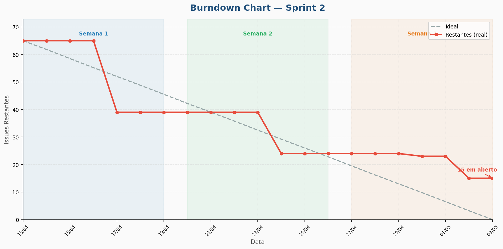

# 📉 Burndown Chart — Sprint 2

**Período:** 13/04/2026 → 03/05/2026 (3 semanas)

| | |
|---|---|
| 📋 Total de issues | 65 |
| ✅ Concluídas | 50 |
| 🔄 Em andamento / abertas | 15 |

---

## Gráfico

> 💡 A linha **vermelha** mostra o progresso real. A linha **cinza tracejada** é o ritmo ideal.

---

## Dados por Dia

| Data | Semana | Concluídas (acum.) | Restantes | Ideal |
|:----:|:------:|:------------------:|:---------:|:-----:|
| 13/04 | Semana 1 | 0 | 65 | 65.0 |
| 14/04 | Semana 1 | 0 | 65 | 61.8 |
| 15/04 | Semana 1 | 0 | 65 | 58.5 |
| 16/04 | Semana 1 | 0 | 65 | 55.2 |
| 17/04 | Semana 1 | 26 | 39 | 52.0 |
| 18/04 | Semana 1 | 26 | 39 | 48.8 |
| 19/04 | Semana 1 | 26 | 39 | 45.5 |
| 20/04 | Semana 2 | 26 | 39 | 42.2 |
| 21/04 | Semana 2 | 26 | 39 | 39.0 |
| 22/04 | Semana 2 | 26 | 39 | 35.8 |
| 23/04 | Semana 2 | 26 | 39 | 32.5 |
| 24/04 | Semana 2 | 41 | 24 | 29.2 |
| 25/04 | Semana 2 | 41 | 24 | 26.0 |
| 26/04 | Semana 2 | 41 | 24 | 22.8 |
| 27/04 | Semana 3 | 41 | 24 | 19.5 |
| 28/04 | Semana 3 | 41 | 24 | 16.2 |
| 29/04 | Semana 3 | 41 | 24 | 13.0 |
| 30/04 | Semana 3 | 42 | 23 | 9.8 |
| 01/05 | Semana 3 | 42 | 23 | 6.5 |
| 02/05 | Semana 3 | 50 | 15 | 3.2 |
| 03/05 | Semana 3 | 50 | 15 | 0.0 |

---

## Resumo por Semana

| Semana | Período | Issues no escopo | Concluídas | Restantes |
|:------:|:-------:|:----------------:|:----------:|:---------:|
| Semana 1 | 13/04 → 19/04 | 38 | 26 | 12 |
| Semana 2 | 20/04 → 26/04 | 17 | 15 | 2 |
| Semana 3 | 27/04 → 03/05 | 10 | 9 | 1 |

---

## Observações

> ⚠️ **Nota metodológica:** como os status foram atualizados em massa no final da sprint, as datas de conclusão foram estimadas com base na semana de criação de cada task:
> - Tasks da **Semana 1** concluídas após 19/04 → estimadas como entregues em **17/04**
> - Tasks da **Semana 2** concluídas após 26/04 → estimadas como entregues em **24/04**
> - Tasks da **Semana 3** → mantiveram a data real de atualização
>
> Para as próximas sprints, marcar cada task como **Concluído no dia em que terminar** vai gerar um burndown automático e preciso direto no Jira.
