# 📘 Manual do Usuário - Tracker

## 📑 Índice
- [O que é o Tracker](#o-que-é-o-tracker)
- [Módulo de Clientes](#módulo-de-clientes)
  - [Cadastro de Novo Cliente](#cadastro-de-novo-cliente)
  - [Contatos da Empresa](#contatos-da-empresa)
- [Módulo de Certificações](#módulo-de-certificações)
  - [Cadastro de Nova Habilidade](#cadastro-de-nova-habilidade)
- [Módulo de Técnicos](#módulo-de-técnicos)
  - [Cadastro de Novo Técnico](#cadastro-de-novo-técnico)
  - [Vincular Certificações](#vincular-certificações-opcional)
- [Módulo de Máquinas](#módulo-de-máquinas)
- [Módulo de Sistemas](#módulo-de-sistemas)
  - [Cadastro de Novo Software](#cadastro-de-novo-software)
- [Módulo de Contratos](#módulo-de-contratos)
  - [Cadastro de Novo Contrato](#cadastro-de-novo-contrato)
  - [Máquinas Base](#máquinas-base)
  - [Softwares](#softwares-opcional)
- [Cadastro de Ordem de Serviço](#cadastro-de-ordem-de-serviço)
  - [Seleção de Máquina](#seleção-de-máquina-ordem-de-serviço)
  - [Seleção de Técnico](#seleção-de-técnico-ordem-de-serviço)
- [Módulo de Gestão de Ordens](#módulo-de-gestão-de-ordens)
  - [Visualização Detalhada da Ordem de Serviço](#visualização-detalhada-da-ordem-de-serviço)
- [Preparação de Viagem – Resumo](#preparação-de-viagem--resumo)
  - [Detalhes da Viagem](#detalhes-da-viagem-preparação)
- [Histórico de Manutenções](#histórico-de-manutenções)
- [Módulo de Ativos](#módulo-de-ativos)
  - [Cadastro e Edição de Ativos](#cadastro-e-edição-de-ativos)
- [Módulo de Calendário / Mapa Operacional](#módulo-de-calendário--mapa-operacional)
- [Módulo Minhas Ordens / Preparação de Viagem](#módulo-minhas-ordens--preparação-de-viagem)
- - [Módulo de Mapa de Cobertura (GIS)](#módulo-de-mapa-de-cobertura-gis)
  - [Indicadores](#indicadores)
  - [Camadas](#camadas)
  - [Legenda](#legenda)
  - [Lista de Técnicos](#lista-de-técnicos)
  - [Mapa](#mapa)
  - [Atualização](#atualização)
- [Módulo de Calendário](#módulo-de-calendário)
  - [Calendário de Ordens](#calendário-de-ordens)
  - [Calendário de Técnicos](#calendário-de-técnicos)
  - [Filtros](#filtros)
  - [Visualização Mensal](#visualização-mensal)
  - [Visualização Semanal](#visualização-semanal)
- [Preparação de Viagem – Resumo](#preparação-de-viagem--resumo)
  - [Detalhes da Viagem](#detalhes-da-viagem-preparação)
- [Preparação de Viagem – Cadastro](#preparação-de-viagem--cadastro)
  - [Etapa 1 — Identificação](#etapa-1--identificação)
  - [Etapa 2 — Deslocamento](#etapa-2--deslocamento)
  - [Etapa 3 — Estimativas](#etapa-3--estimativas)
  - [Etapa 4 — Paradas](#etapa-4--paradas)
  - [Etapa 5 — Revisão](#etapa-5--revisão) 

---

## O que é o Tracker 

O **Tracker** consiste em um Sistema de Gestão de Manutenções que centraliza o cadastro de clientes, sistemas, contratos, ativos e técnicos.

Através dele, é possível:
- Planejar e registrar ordens de manutenção com base no uso dos equipamentos
- Organizar deslocamentos e atendimentos técnicos
- Monitorar prazos, SLAs e contratos
- Visualizar dashboards e relatórios operacionais

O sistema permite priorizar atendimentos, evitar atrasos contratuais e melhorar a eficiência da operação.

---

## Módulo de Clientes

Este módulo permite a gestão centralizada das empresas parceiras e o acompanhamento de seus contratos.

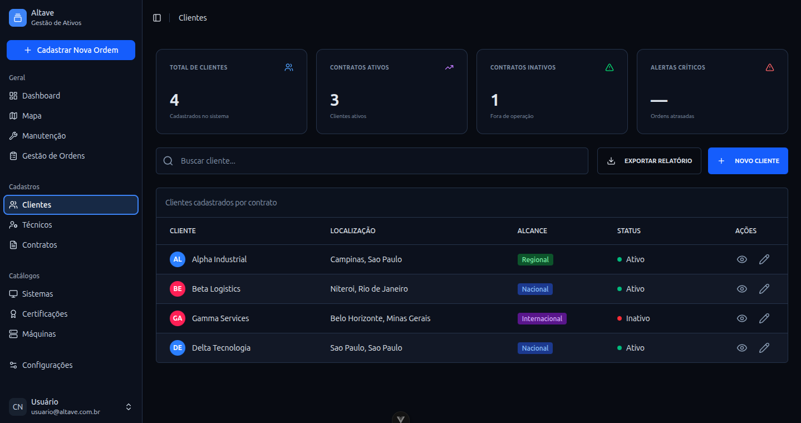

### Indicadores e Funcionalidades

#### Indicadores (Dashboard)
- **Total de Clientes**: quantidade total cadastrada
- **Contratos Ativos/Inativos**: status operacional
- **Alertas Críticos**: pendências ou atrasos relevantes

#### Pesquisa e Ações
- Busca por nome da empresa
- Exportação de relatórios
- Botão **Novo Cliente** para cadastro

#### Listagem
- Nome da empresa
- Localização e abrangência (regional/nacional/internacional)
- Status (Ativo/Inativo)
- Ações: visualizar ou editar

---

## Cadastro de Novo Cliente

Permite registrar uma nova empresa no sistema.

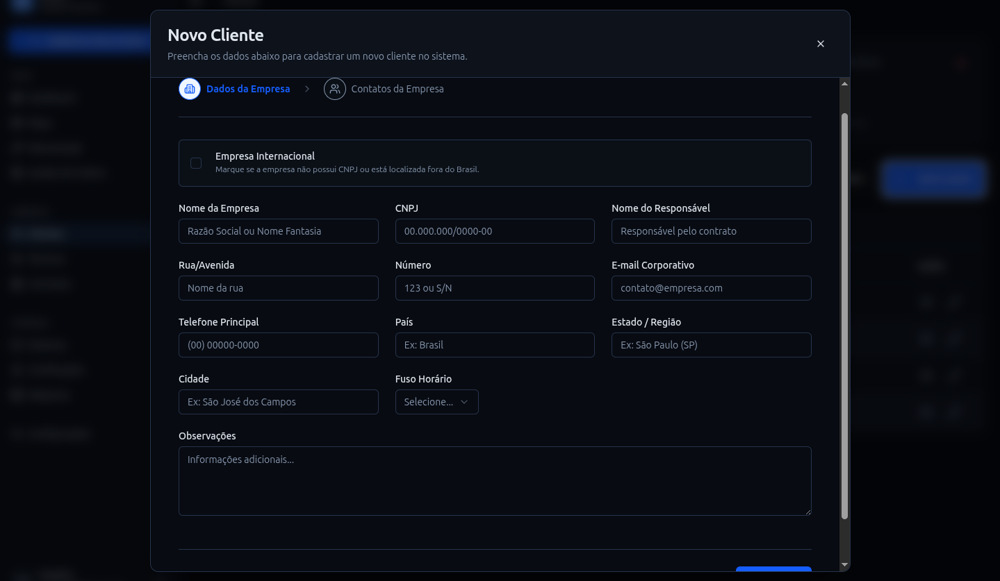

### Etapas do Cadastro

1. **Dados da Empresa**
2. **Contatos da Empresa**

### Dados da Empresa

- Nome da empresa (razão social ou fantasia)
- CNPJ (ou opção internacional)
- Nome do responsável
- Endereço completo
- E-mail corporativo
- Telefone
- Fuso horário
- Observações (opcional)

### Controles

- Cancelar cadastro
- Navegação entre etapas

---

## Contatos da Empresa

Permite adicionar contatos vinculados ao cliente.

- Nome, e-mail e telefone
- Adição de múltiplos contatos
- Remoção de contatos

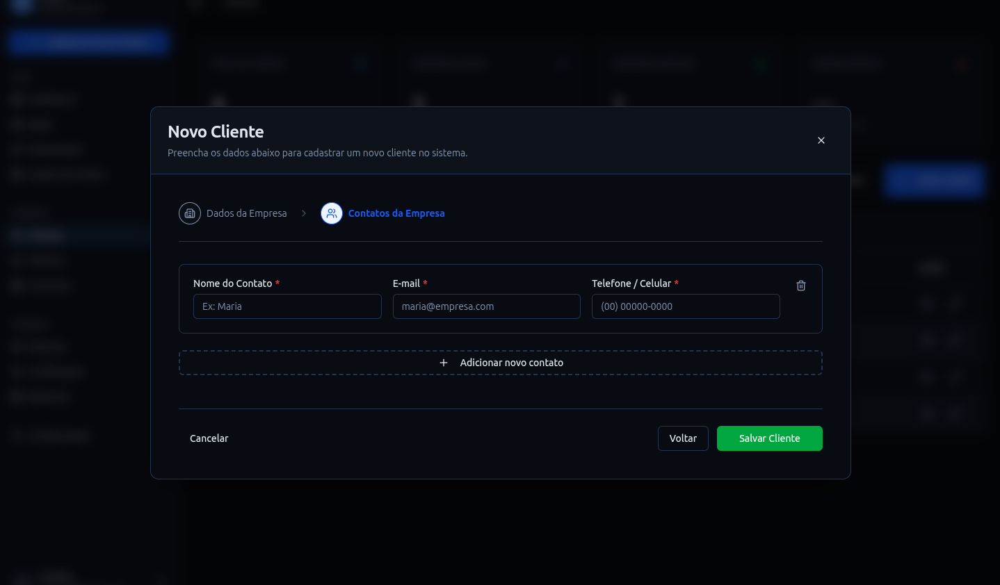

---

## Módulo de Certificações

Gerencia habilidades e competências.

### Funcionalidades:
- Cadastro de certificações
- Busca e edição
- Exclusão controlada

---

## Cadastro de Nova Habilidade

- Nome da certificação
- Observações
- Salvamento no catálogo

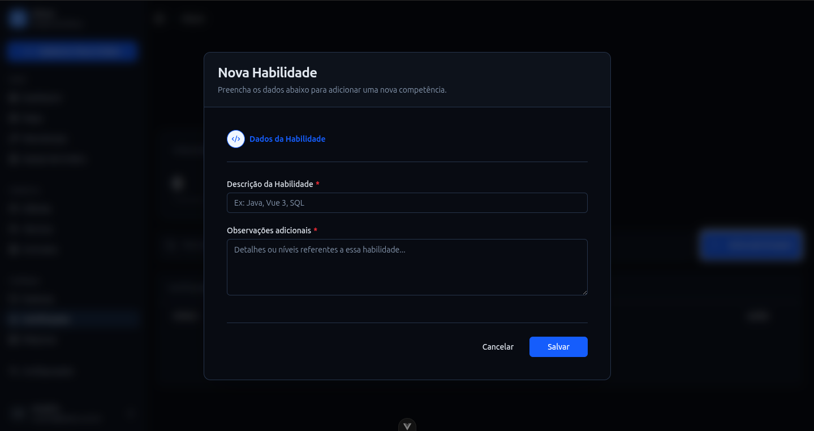

---

## Módulo de Técnicos

Gerencia equipe operacional.

### Funcionalidades:
- Controle de disponibilidade
- Certificações
- Exportação de dados

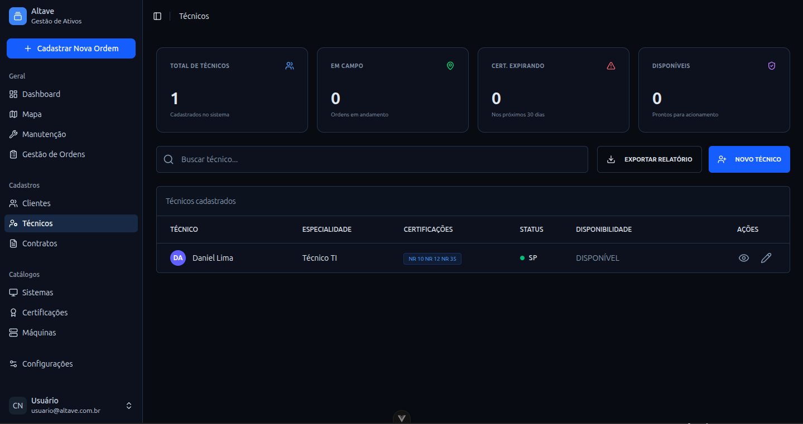

---

## Cadastro de Novo Técnico

### Dados obrigatórios:
- Nome e CPF
- Email e senha
- Cargo e telefone
- Estado e disponibilidade

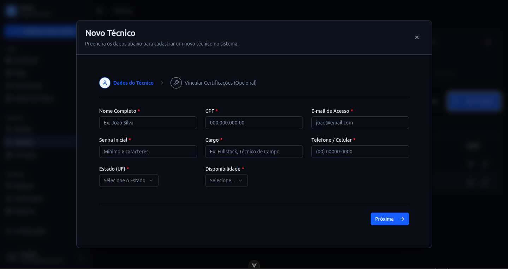

---

## Vincular Certificações (Opcional)

- Selecionar certificação
- Definir nível (1 a 5)
- Inserir validade

---

## Módulo de Máquinas

Gerencia ativos físicos.

### Funcionalidades:
- Cadastro de modelos
- Especificações técnicas
- Limite de manutenção

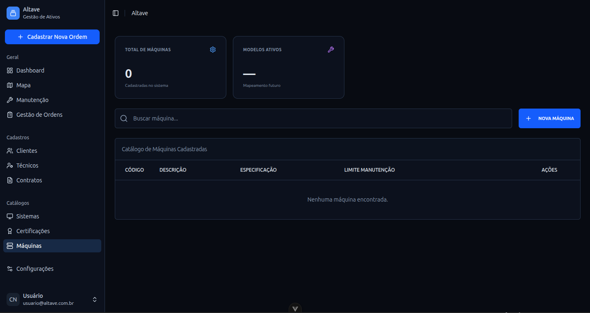

---

## Módulo de Sistemas

Gerencia softwares e licenças.

### Funcionalidades:
- Cadastro de sistemas
- Controle de versões
- Fornecedores

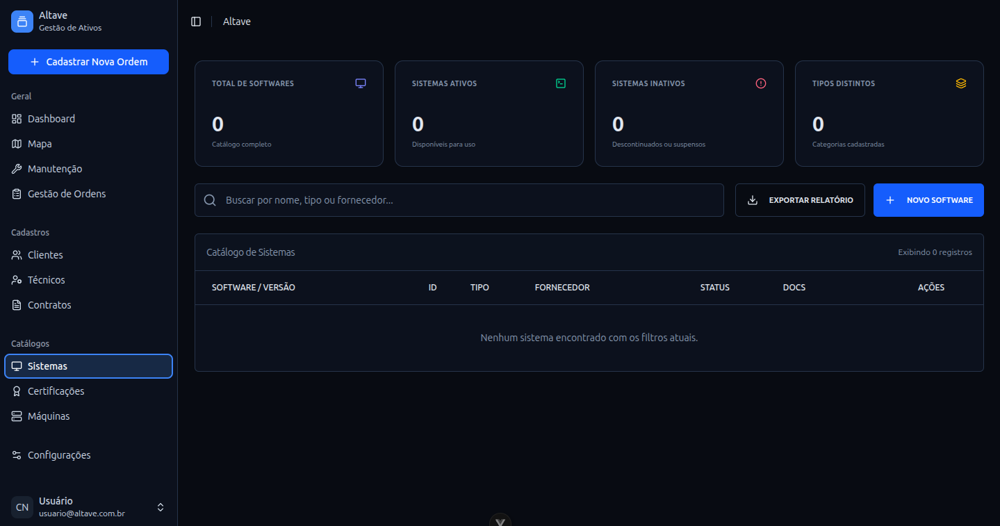

---

## Cadastro de Novo Software

- Nome, versão e tipo
- Fornecedor
- Documentação
- Checklist técnico

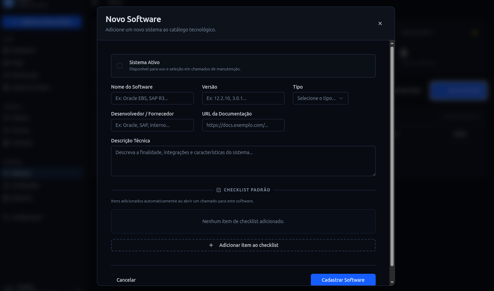

---

## Módulo de Contratos

Centraliza contratos e vínculos.

### Funcionalidades:
- Indicadores financeiros
- Alertas
- Controle de vigência

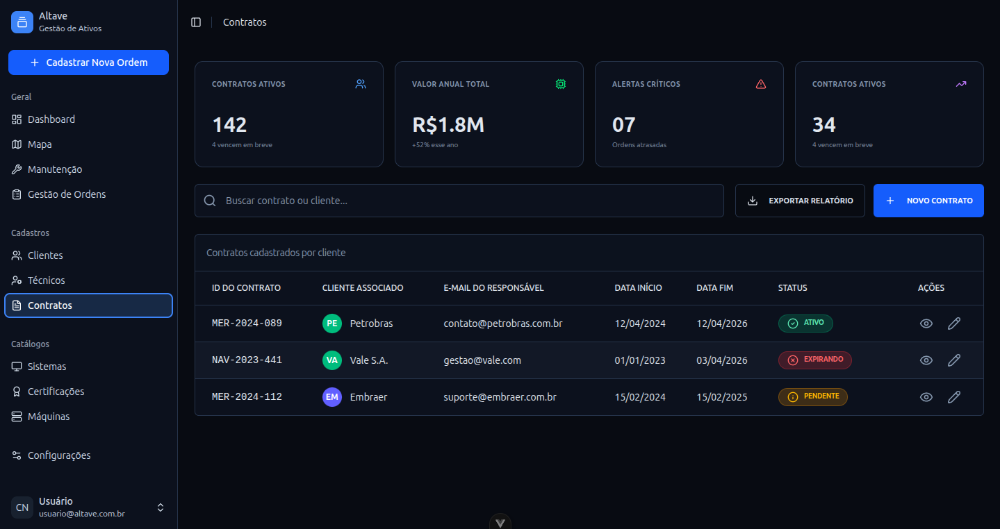

---

## Cadastro de Novo Contrato

### Etapas:
1. Dados do contrato
2. Máquinas base
3. Softwares

- Vigência
- SLA
- Manutenção

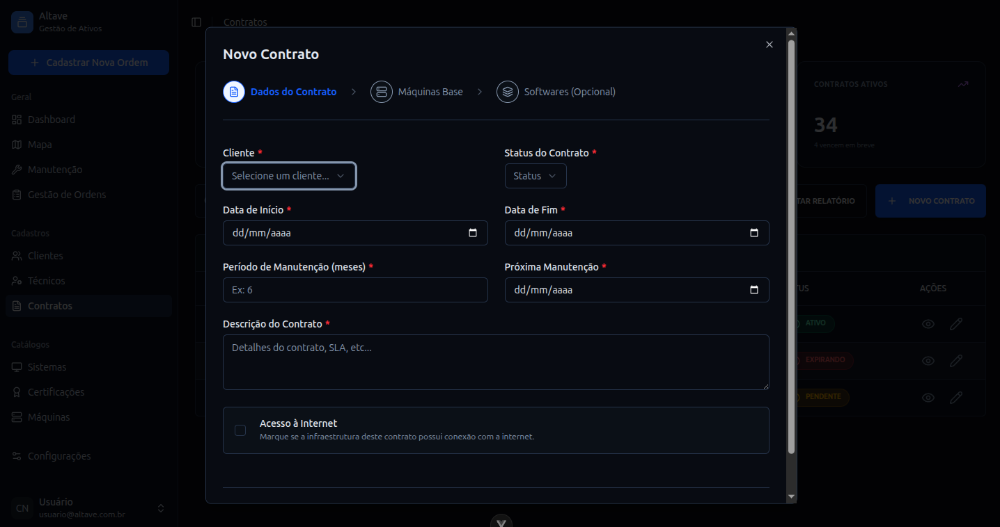

---

## Máquinas Base

- Seleção de equipamentos
- Identificação e localização
- Inclusão múltipla

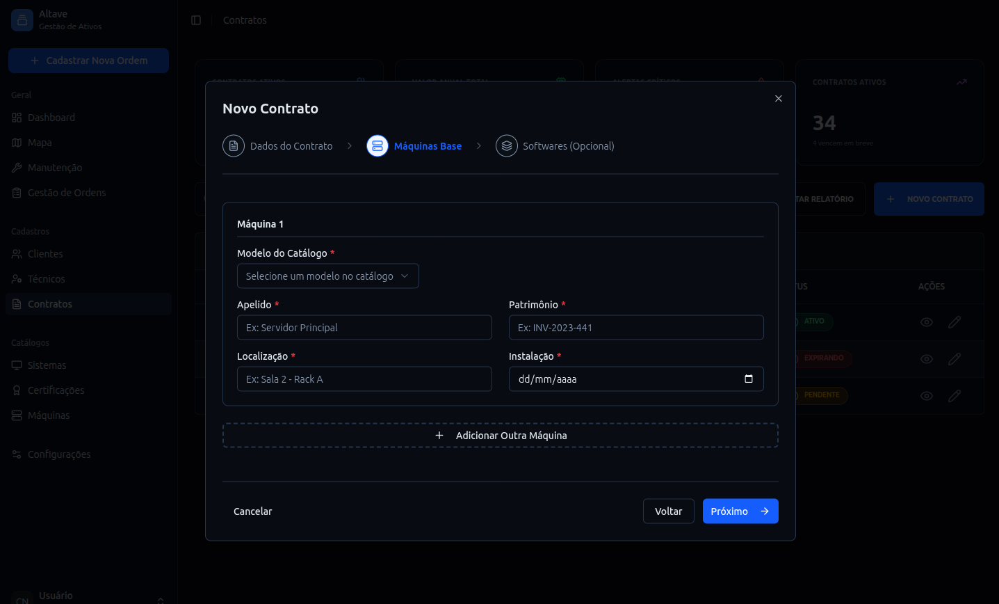

---

## Softwares (Opcional)

- Vincular softwares ao contrato
- Etapa opcional

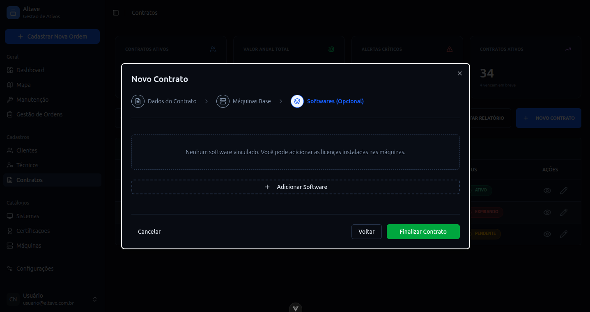

---

## Cadastro de Ordem de Serviço

Permite abrir chamados técnicos vinculando cliente, contrato e técnico.

### Identificação
- Cliente  
- Contrato  
- Criticidade  
- Data de abertura (automática)  
- Data de agendamento  
- Observação  

### Etapas
1. Identificação  
2. Máquina  
3. Técnico  

### Ações
- **Próximo**: avançar  
- **Fechar**: cancelar

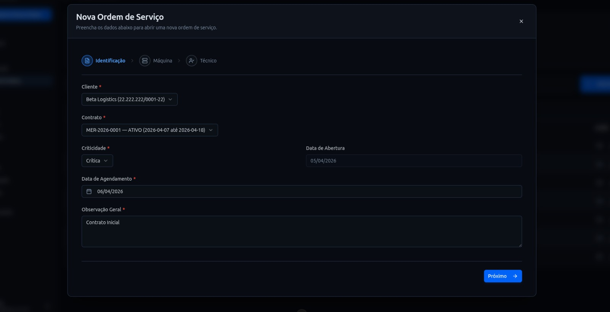

---

## Seleção de Máquina (Ordem de Serviço)

Nesta etapa, é definido o equipamento que será atendido na ordem de serviço.

### Informações

- **Modelo**: Seleção do equipamento cadastrado  
- **Identificação**: Nome ou apelido do ativo  
- **Localização**: Onde o equipamento está instalado  
- **Data de Instalação**: Registro da instalação  

---

### Ações

- **Adicionar Máquina**: incluir mais ativos  
- **Voltar**: retornar à etapa anterior  
- **Próximo**: avançar para seleção do técnico  
- **Cancelar**: encerrar sem salvar

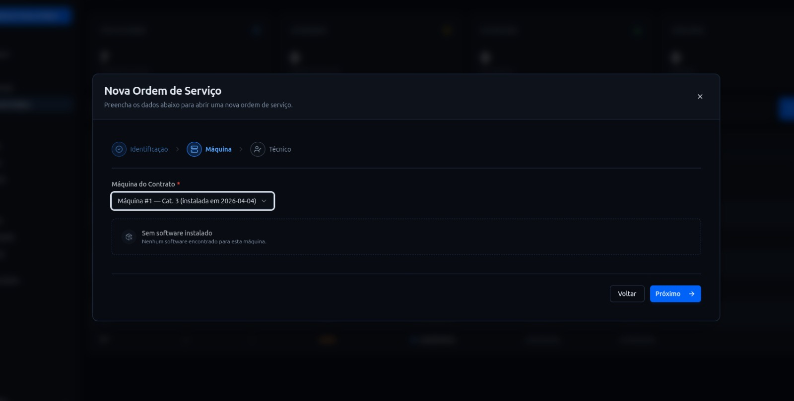

--- 

## Seleção de Técnico (ordem de serviço)

- Vincular técnico ao contrato

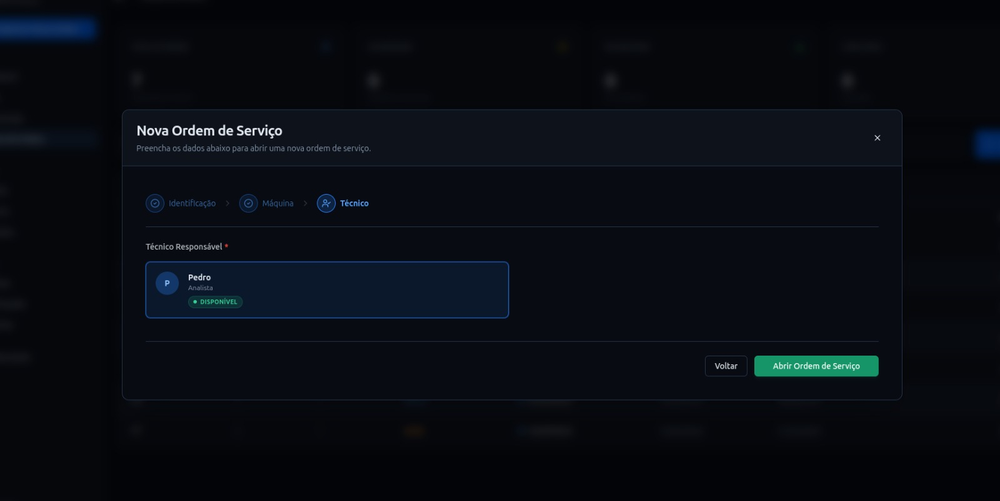

---

# Módulo de Gestão de Ordens

Este módulo permite acompanhar, pesquisar e gerenciar todas as ordens de serviço cadastradas no sistema Tracker.

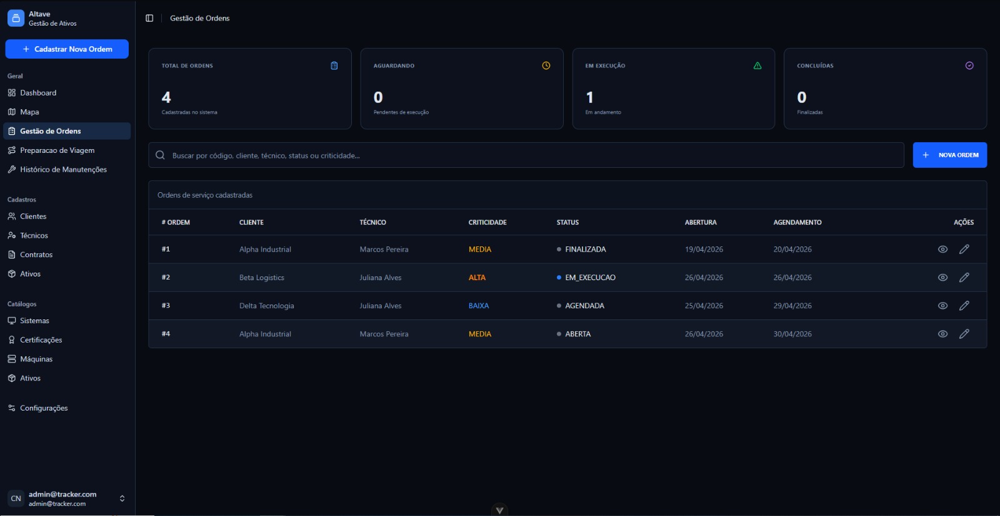

---
# Visualização Detalhada da Ordem de Serviço
Esta tela permite consultar todas as informações de uma ordem de serviço, incluindo progresso, cliente, técnico, recursos e checklists.

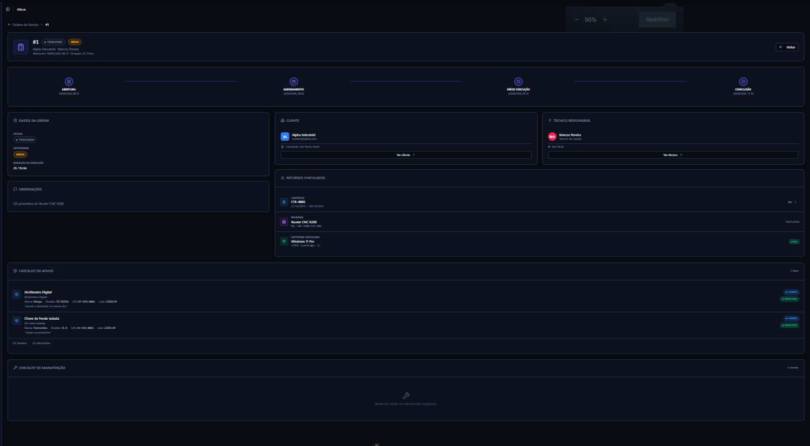

---

## Cabeçalho da Ordem
Exibe número, status, criticidade, cliente, técnico, data de abertura e duração total.

### Ações
- **Voltar**: retorna para a listagem de ordens

---

## Linha do Tempo Operacional
Apresenta as etapas cronológicas da ordem: Abertura, Agendamento, Início da Execução e Conclusão.

---

## Dados da Ordem
Exibe status, criticidade e duração da execução.

---

## Observações
Área destinada a registros complementares, como descrição do problema, tipo de manutenção e observações técnicas.

---

## Cliente
Exibe nome da empresa, contato principal e localização.

### Ações
- **Ver cliente**: acessa o cadastro completo

---

## Técnico Responsável
Exibe nome, cargo e região do profissional associado à ordem.

### Ações
- **Ver técnico**: acessa o perfil detalhado

---

## Recursos Vinculados
Lista contrato, equipamento, software e status operacional dos recursos associados à ordem.

---

## Checklist de Ativos
Lista os itens físicos utilizados no atendimento, com nome, tipo, marca/modelo, número de série, lote, status de uso e situação de devolução.

---

## Checklist de Manutenção
Registra as tarefas técnicas executadas. Caso não haja tarefas, o sistema informa ausência de atividades.

---

# Preparação de Viagem – Resumo

Tela para visualizar, acompanhar e acessar detalhes das viagens.

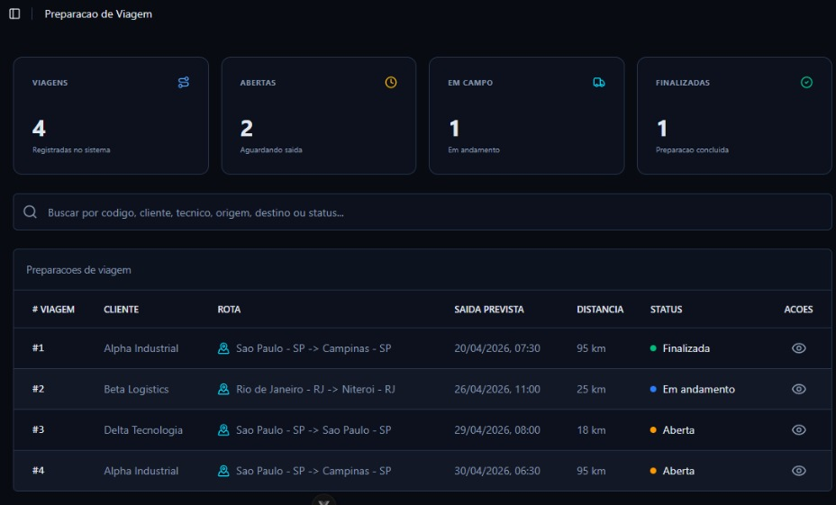

## Resumo
- Total de viagens
- Abertas
- Em andamento
- Finalizadas

---

## Busca
Filtrar por:
- Código, cliente, técnico, rota ou status

---

## Lista de Viagens
- Código
- Cliente
- Rota
- Saída prevista
- Distância
- Status
- Ação (detalhes)

---

## Detalhes da Viagem

### Informações Gerais
- Cliente, rota, status
- Finalizar preparação

### Deslocamento
- Distância, tempo, responsável
- Saída e retorno

### Ordem de Serviço
- Número, equipamentos, tipo

### Paradas
- Quantidade e locais

### Equipamentos
- Itens utilizados

### Rota
- Mapa (futuro)

### Observações
- Informações adicionais

---

## Ações
- Visualizar detalhes
- Finalizar preparação

---

# Detalhes da Viagem (Preparação)

Esta tela apresenta **todas as informações detalhadas** de uma viagem selecionada, permitindo acompanhamento completo da preparação, deslocamento e execução da ordem de serviço.

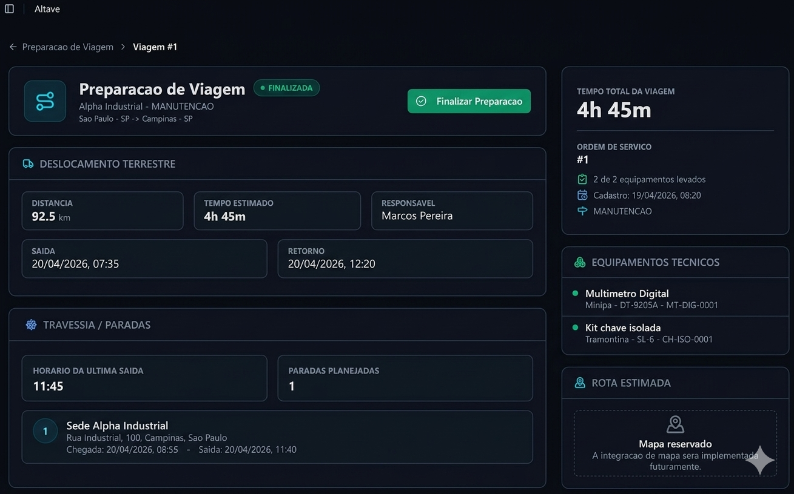

---

# Histórico de Manutenções 

Tela para acompanhar o histórico e status das manutenções.

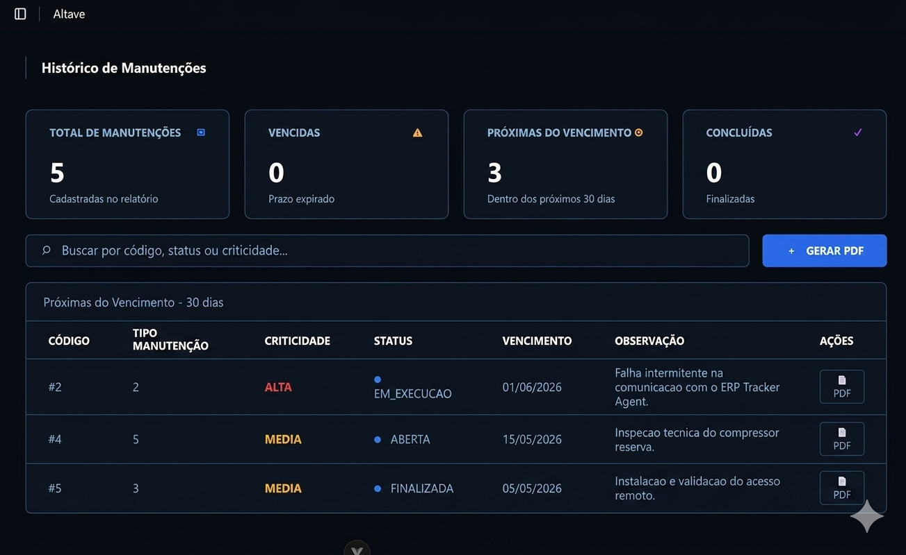

---

## Resumo
- Total de manutenções
- Vencidas
- Próximas do vencimento
- Concluídas

---

## Busca
Filtrar por:
- Código, status ou criticidade

---

## Ação Global
- **Gerar PDF** do relatório

---

## Tabelas

###  Manutenções Vencidas
- Lista de manutenções com prazo expirado
- Mensagem exibida se não houver registros

### Próximas do Vencimento
- Código
- Tipo de manutenção
- Criticidade (Alta, Média, etc.)
- Status (Aberta, Em execução, Finalizada)
- Data de vencimento
- Observações
- Ação: gerar PDF

---

## Ações
- Gerar PDF individual
- Gerar relatório geral

---

## Módulo de Ativos
Este módulo permite gerenciar o inventário completo de ativos utilizados nas operações técnicas, incluindo ferramentas, equipamentos, dispositivos e responsáveis vinculados.

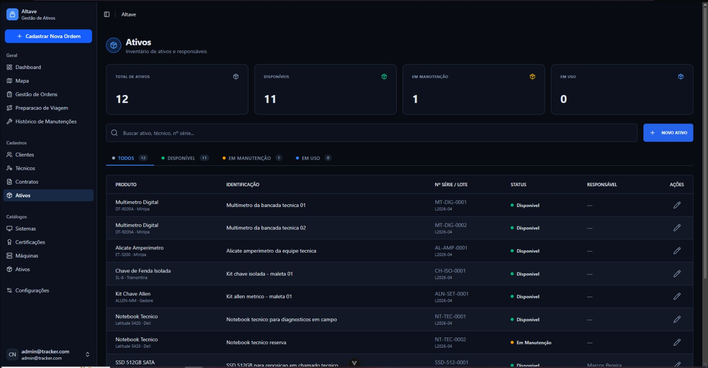

### Indicadores e Funcionalidades
#### Indicadores (Dashboard)
- **Total de Ativos**: quantidade total de itens cadastrados
- **Disponíveis**: ativos prontos para uso imediato
- **Em Manutenção**: itens temporariamente indisponíveis
- **Em Uso**: ativos vinculados a técnicos ou ordens de serviço

#### Pesquisa e Ações
- Busca por nome, identificação, técnico responsável, número de série ou lote
- Filtros por status: Todos, Disponível, Em Manutenção, Em Uso
- Botão **Novo Ativo** para cadastro

#### Listagem
- Nome e modelo do produto
- Identificação operacional
- Número de série e lote
- Status (Disponível, Em Manutenção, Em Uso)
- Técnico responsável (quando aplicável)
- Ações: editar ou atualizar cadastro

---

## Cadastro e Edição de Ativos
Estas telas permitem registrar novos ativos no sistema e atualizar informações de itens já cadastrados no inventário operacional.

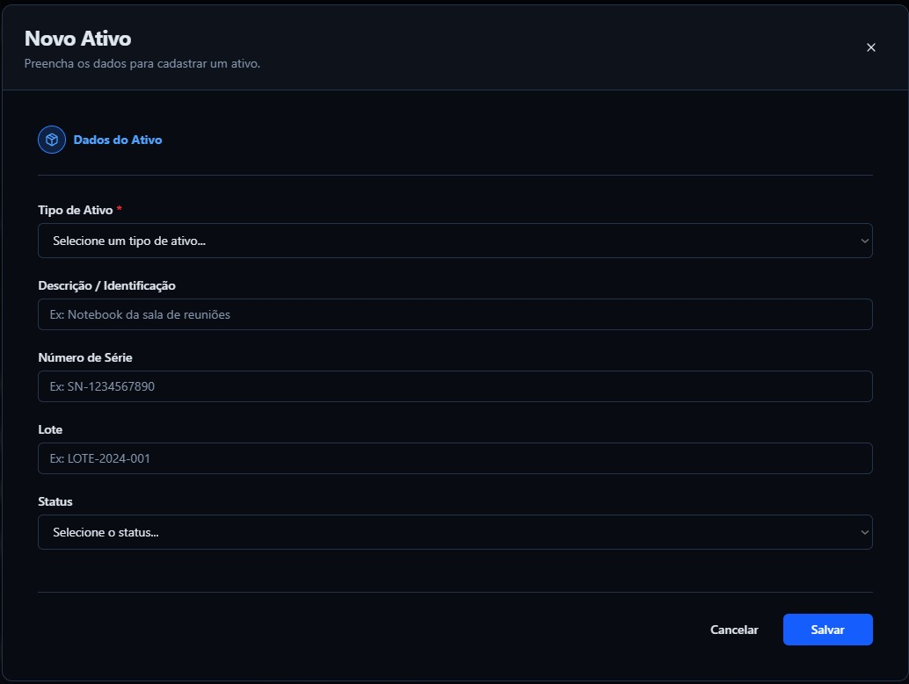

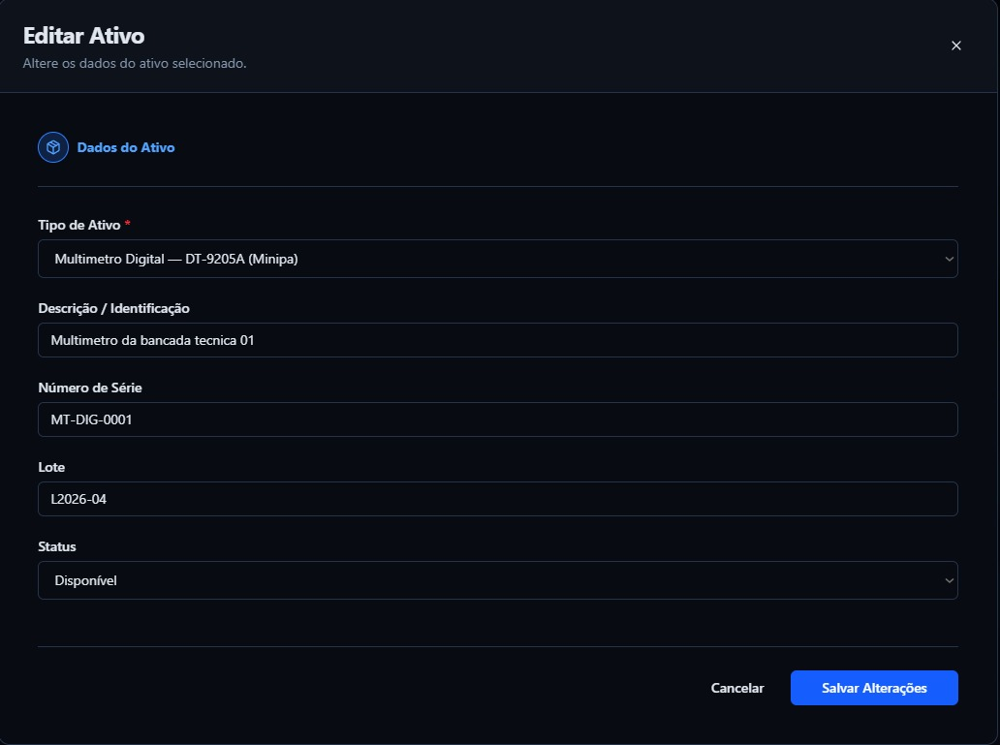

### Campos
- **Tipo de Ativo**: seleção do modelo ou categoria (ex: multímetro, notebook, ferramentas)
- **Descrição / Identificação**: nome operacional ou descrição interna
- **Número de Série**: código único de rastreamento patrimonial
- **Lote**: identificação de lote ou grupo de aquisição
- **Status**: situação operacional (Disponível, Em Manutenção, Em Uso)

---

## Módulo de Calendário / Mapa Operacional
Esta tela permite visualizar cronologicamente todas as ordens de serviço agendadas, facilitando o planejamento operacional e o acompanhamento de atendimentos futuros.

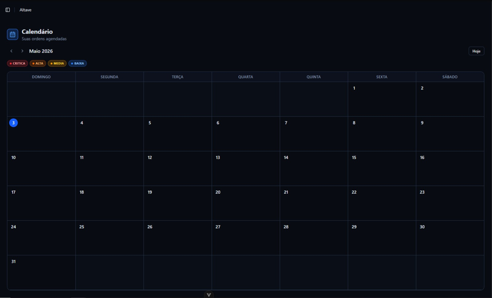

### Indicadores e Funcionalidades
#### Calendário (Visão Mensal)
- **Mês e ano atual**: navegação entre meses com botão **Hoje** para retorno rápido
- **Ordens por dia**: volume de atendimentos programados por data
- **Criticidade**: classificação visual por prioridade (Crítica, Alta, Média, Baixa)

#### Gestão de Agendamentos
- Consulta rápida de volume operacional
- Distribuição e organização de atendimentos por data
- Planejamento de equipes e logística

---

## Módulo Minhas Ordens / Preparação de Viagem
Este módulo permite ao técnico visualizar todas as ordens atribuídas a ele e preparar os recursos e tarefas necessários antes da execução.

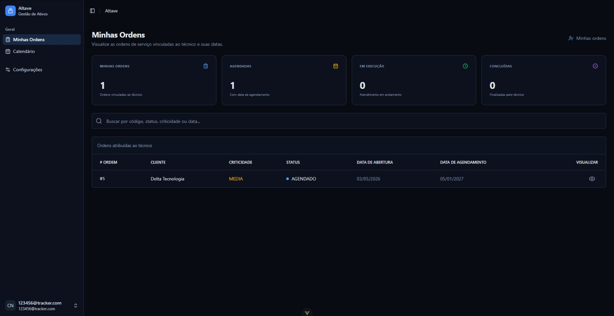

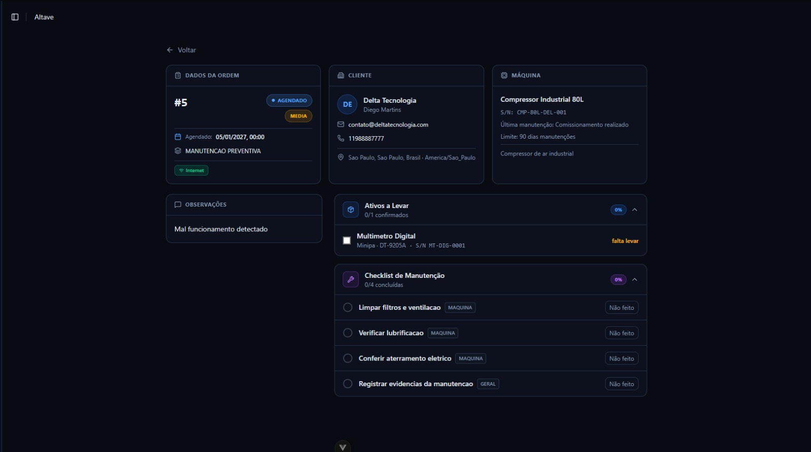

### Minhas Ordens
#### Indicadores (Dashboard)
- **Minhas Ordens**: total de ordens atribuídas
- **Agendadas**: ordens futuras
- **Em Execução**: atendimentos em andamento
- **Concluídas**: ordens finalizadas

#### Pesquisa e Ações
- Busca por código, status, criticidade ou data

#### Listagem
- Número da ordem, cliente, criticidade, status, data de abertura e data de agendamento
- Ações: visualizar ordem

---

### Preparação de Viagem
Ao selecionar uma ordem, o técnico acessa a visão operacional completa para execução.

#### Dados da Ordem
- Número, status, criticidade, data de agendamento, tipo de manutenção e tipo de deslocamento

#### Cliente e Máquina
- Nome, contato, telefone e localização do cliente
- Equipamento vinculado, número de série, última e próxima manutenção

#### Execução
- **Observações**: detalhes adicionais da manutenção
- **Ativos a Levar**: lista de equipamentos necessários para o atendimento
- **Checklist de Manutenção**: tarefas técnicas obrigatórias com status (Não feito / Concluído)
- **Progresso**: acompanhamento percentual da preparação e execução

---

# Mapa de Cobertura (GIS)

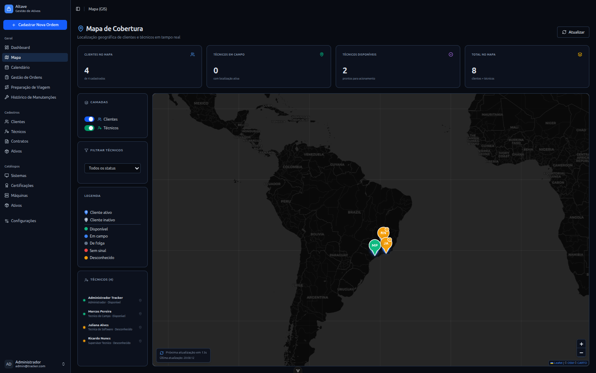

## Objetivo
A tela **Mapa de Cobertura** permite visualizar a localização geográfica de clientes e técnicos, facilitando o acompanhamento das operações em campo.

---

## Indicadores

| Indicador | Descrição |
|------------|------------|
| Clientes no Mapa | Quantidade de clientes cadastrados com localização. |
| Técnicos em Campo | Técnicos atualmente em atendimento ou deslocamento. |
| Técnicos Disponíveis | Técnicos aptos para acionamento. |
| Total no Mapa | Total de clientes e técnicos exibidos. |

---

## Camadas

Permite controlar a exibição dos elementos no mapa:

- **Clientes**: Exibe ou oculta os clientes cadastrados.
- **Técnicos**: Exibe ou oculta os técnicos cadastrados.

---

## Legenda

### Clientes
- 🔵 Cliente ativo
- ⚪ Cliente inativo

### Técnicos
- 🟢 Disponível
- 🔵 Em campo
- ⚫ De folga
- 🔴 Sem sinal
- 🟠 Desconhecido

---

## Lista de Técnicos

Exibe os técnicos cadastrados com:
- Nome;
- Função;
- Status atual.

---

## Mapa

O mapa apresenta marcadores geográficos de clientes e técnicos.

### Funcionalidades
- Navegação por zoom (+ e -);
- Visualização da localização dos registros;
- Atualização manual através do botão **Atualizar**.

---

## Atualização

As informações do mapa são atualizadas periodicamente e podem ser sincronizadas manualmente pelo botão **Atualizar** localizado no canto superior direito.

---

# Módulo de Calendário

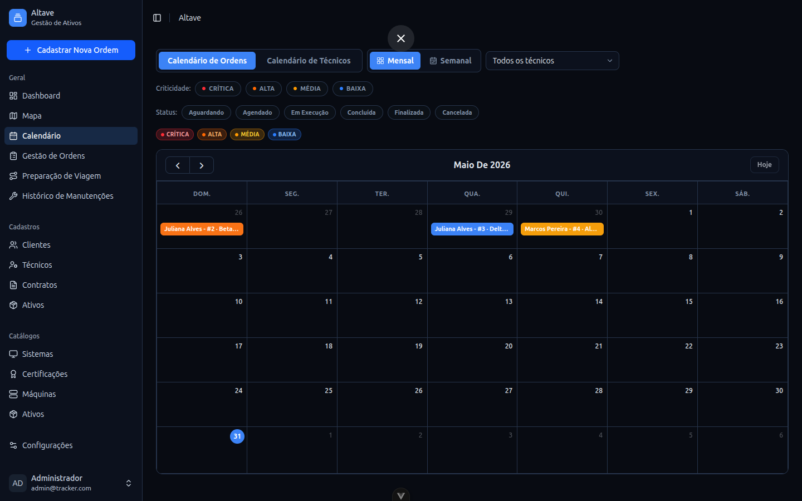

## Objetivo

O módulo de Calendário permite acompanhar a programação das ordens de serviço e a disponibilidade dos técnicos por meio de visualizações mensais e semanais.

---

## Calendário de Ordens

Exibe as ordens de serviço agendadas em formato de calendário.

As ordens são identificadas por cores de acordo com sua criticidade, facilitando a priorização das atividades.

---

## Calendário de Técnicos

Exibe a agenda dos técnicos, permitindo visualizar períodos ocupados e disponibilidade para novos atendimentos.

---

## Filtros

O calendário pode ser filtrado pelos seguintes critérios:

### Criticidade
- Crítica
- Alta
- Média
- Baixa

### Status da Ordem
- Aguardando
- Agendado
- Em Execução
- Concluída
- Finalizada
- Cancelada

### Técnicos
Permite visualizar todos os técnicos ou selecionar um técnico específico.

---

## Visualização Mensal

Apresenta todas as ordens distribuídas ao longo do mês selecionado.

### Funcionalidades
- Navegação entre meses;
- Visualização rápida das ordens agendadas;
- Retorno ao período atual através do botão **Hoje**.

---

## Visualização Semanal

Apresenta a programação detalhada da semana.

### Funcionalidades
- Visualização por dias e horários;
- Navegação entre semanas;
- Retorno à semana atual através do botão **Hoje**.

---

## Navegação

Utilize os botões de seta para avançar ou retroceder entre períodos do calendário.

O botão **Hoje** reposiciona a visualização para o período atual.

---

# Preparação de Viagem

## Objetivo
Cadastrar uma nova preparação de viagem para execução de serviços em campo.

## Como cadastrar

1. Acesse **Preparação de Viagem**.
2. Clique em **Nova Preparação**.
3. Preencha as etapas do assistente e clique em **Próximo** para avançar.

---

## Etapa 1 — Identificação

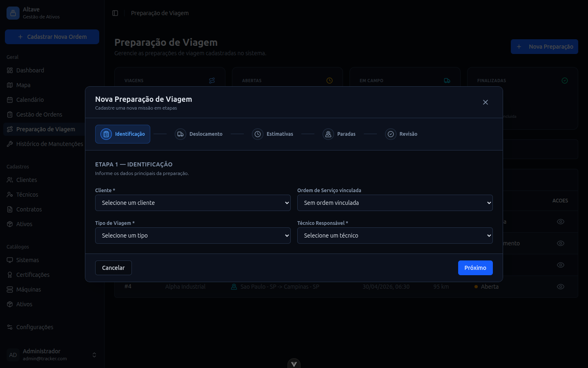

Informe os dados básicos da viagem:

- **Cliente** *(obrigatório)*
- **Ordem de Serviço vinculada** *(opcional)*
- **Tipo de Viagem** *(obrigatório)*
- **Técnico Responsável** *(obrigatório)*

Clique em **Próximo**.

---

## Etapa 2 — Deslocamento

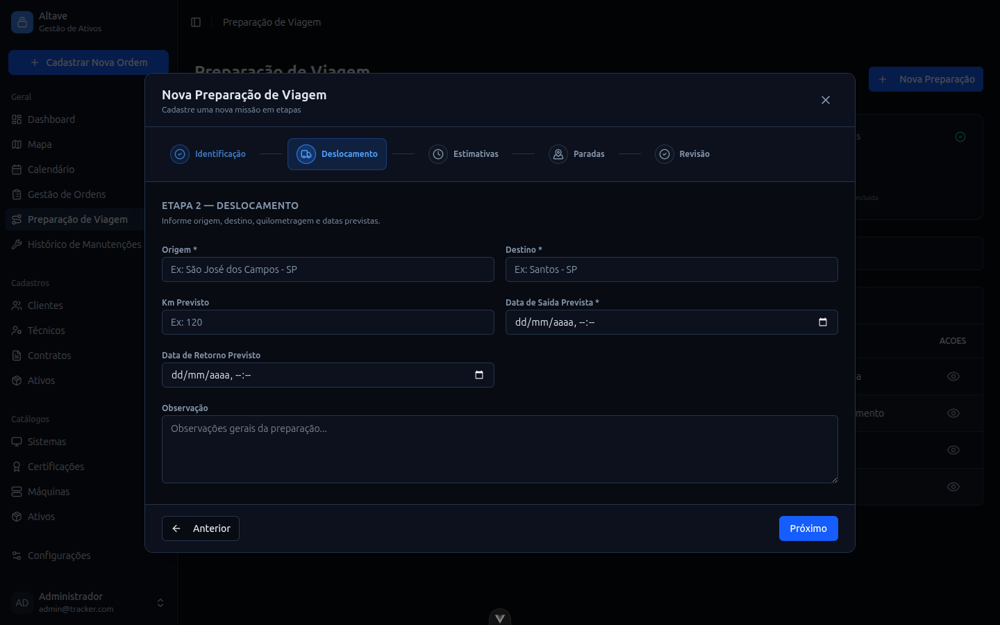

Informe os dados do trajeto:

- **Origem**
- **Destino**
- **Km Previsto**
- **Data de Saída Prevista**
- **Data de Retorno Prevista**
- **Observação**

Clique em **Próximo**.

---

## Etapa 3 — Estimativas

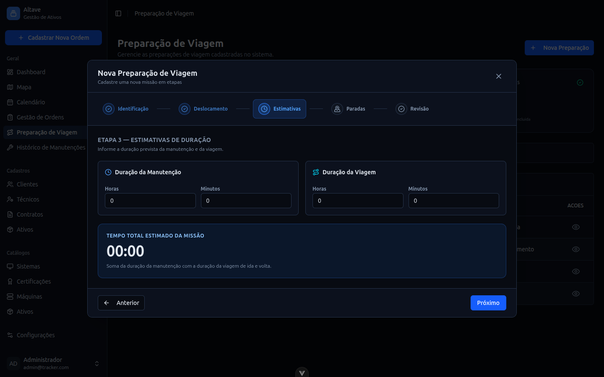

Informe o tempo previsto para execução da missão:

### Duração da Manutenção
- Horas
- Minutos

### Duração da Viagem
- Horas
- Minutos

O sistema calcula automaticamente o **Tempo Total Estimado da Missão**.

Clique em **Próximo**.

---

## Etapa 4 — Paradas

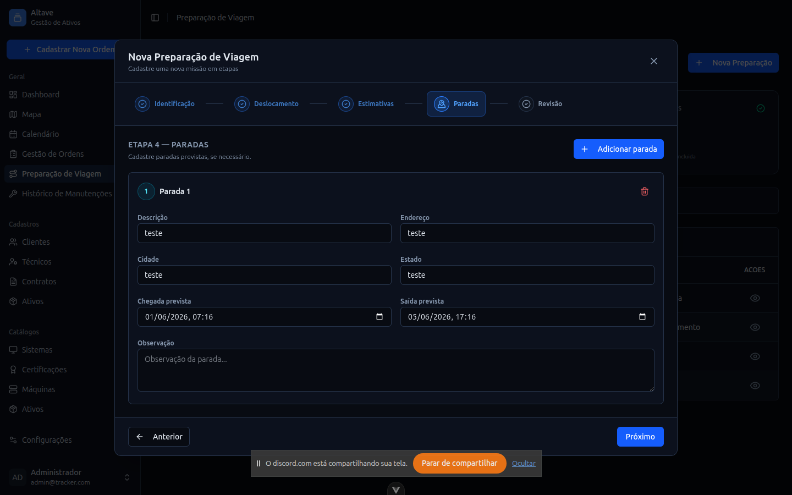

Cadastre paradas previstas durante o deslocamento.

Para adicionar uma parada, clique em **Adicionar parada**.

Dados disponíveis:

- Descrição
- Endereço
- Cidade
- Estado/Região
- Chegada Prevista
- Saída Prevista
- Observação

Para remover uma parada, clique no ícone de **lixeira**.

Clique em **Próximo**.

---

## Etapa 5 — Revisão

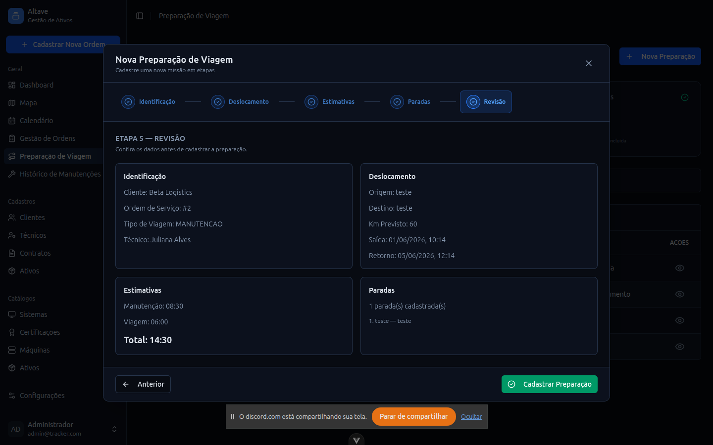

Revise todas as informações informadas.

Se necessário, utilize **Anterior** para realizar ajustes.

Clique em **Salvar/Concluir** para finalizar o cadastro da preparação de viagem.

---

## Consulta

As preparações cadastradas ficam disponíveis na listagem principal, onde é possível acompanhar seu status e visualizar os detalhes.

